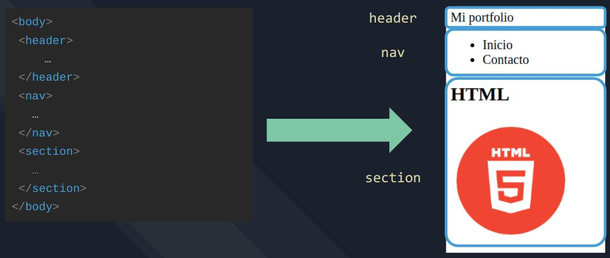

# Actividad de clase
Actividad a desarrollar en clase (10~15 minutos). Compartir el resultado por el canal del curso.

Utilice el explorador de tu preferencia y observa el resultado.
Contarás con 5/10 minutos para realizar la actividad.

### Enunciado:
- Dentro de la carpeta actividad_clase crear un archivo "index.html" con la estructura básica de HTML.
- Crear la estructura básica de HTML utilizando el atajo de Emmet (!)
- Dentro de la etiqueta body crear una etiqueta ```<header>```. Dentro de esa etiqueta colocar un título.
- Dentro de la etiqueta body crear una etiqueta ```<nav>```. Dentro de esa etiqueta colocar una lista de desordenada con al menos dos items.
- Dentro de la etiqueta body crear una etiqueta ```<section>```. Dentro de esa etiqueta colocar la imagen de "html_log.png" que tiene a disposición dentro de logo.



### Resultado aproximado:

