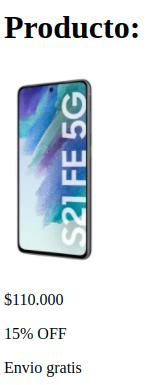

# Desafío

Para esta tarea vamos a recrear algunas de las estructuras más utilizadas dentro de la páginas webs, como son las cards y los navbar. Dentro de esta carpeta de ejercicios tendrá disponible la carpeta "images" con los recursos necesarios para completar los ejercicios.

Los pasos que debemos seguir para conseguir esta tarea, serán:

- Haber realizado el fork de este repositorio y haberlo descargado a su computadora.
- Generar el HTML pertinente para cada ejemplo
- Tratar de replicar los ejemplos mostrados
- Utilizar las imagenes dentro de images

Finalmente te invitamos a que una vez que lo hallas logrado, dejes volar tu creatividad y generes otros ejemplos por tu cuenta o trates de integrar los ejemplos antes mostrados.

# Enunciado:
1- Crear el archivo index.html que utilizará para realizar este desafío dentro de la carpeta de este enunciado.\
2- Debe intentar replicar la siguiente imagen de referencia. ¡Ojo! Preste atención al tamaño que tiene la imagen del celular en la captura, ¿Cómo puede usted ajustar su tamaño para que sea parecido a la imagen a lograr?

3- Verificado que todo funciona como se espera, deberá subir al campus el link de su respositorio en el desafio correspondiente para así concluir la realización del mismo.

