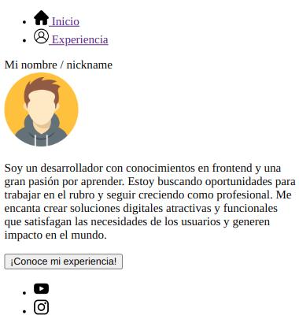

# Ejercicio de profundización

__NOTA:__ Se recuerda que los ejercicios de prfundización son para aquellas personas que puedan dedicarle más tiempo a practicar, son desafios extra. Lo idea es que puedan simpre completar primero los ejercicios de práctica y comprenderlos bien antes de hacer un ejercicio de profundización.

Dentro de esta carpeta encontrará unas imagénes del sitio web que deberá armar, el cual está orientado a que realice un portfolio utilizando unicamente lo visto hasta ahora de HTML.

### Misión

Su misión, si decide aceptarla, es armar un sitio web de dos páginas:
- Una página "index.html" que contendrá su nombre, foto y una breve descripción suya.
- Una página "experiencia.html" que hable sobre su experiencia en HTML & CSS.

Les dejamos unos ejemplos de como debería verse su página:

Deberá generar los archivos HTML mencionados

### Detalle
Podrá ver en la imagen que ambos HTML tienen la parte superior e inferior de la página en común, estos son el header y footer de ambas páginas que deben ser iguales.
- En el header debe colocar una navbar que cuando usted haga click en los enlaces lo lleve a una página u otra.
- En el footer debe colocar los logos de sus redes sociales y contacto que usted desee dejar.

El contenido de las páginas deberá estar armado dentro de una sección o un artículo. Puede observar que siempre se repite el mismo patron tipo "card":
- Un título de la sección o article (puede ser un div o un título)
- Una imagen
- Una descripción (un parrafo)

La idea es que su sitio web refleje lo indicado en los ejemplos o parte del contenido (use su imaginación ^_^). No es necesario que sea 100% igual, ¡el objetivo es que practique y experimente!

### ¡Mucha suerte! ¡Cualquier duda nos consultan!
