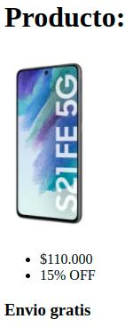
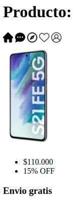

# Tarea

Para esta tarea vamos a recrear algunas de las estructuras más utilizadas dentro de la páginas webs, como son las cards y los navbar. Dentro de esta carpeta de ejercicios tendrá disponible la carpeta "images" con los recursos necesarios para completar los ejercicios.

Los pasos que debemos seguir para conseguir esta tarea, serán:

- Generar el HTML pertinente para cada ejemplo
- Tratar de replicar los ejemplos mostrados
- Utilizar las imagenes dentro de images

Finalmente te invitamos a que una vez que lo hallas logrado, dejes volar tu creatividad y generes otros ejemplos por tu cuenta o trates de integrar los ejemplos antes mostrados.

## Ejercicio 1
Debe intentar replicar la siguiente imagen de referencia. ¡Ojo! Preste atención al tamaño que tiene la imagen del celular en la captura, ¿Cómo puede usted ajustar su tamaño para que sea parecido a la imagen a lograr?

## Ejercicio 2
Parecido al ejercicio anterior, pero si observa con cuidado verá que hay elementos que están colocados como una lista de elementos. Arme su HTML para contemplar los cambios que se reflejan en la imagen:

## Ejercicio 3
Tome el ejercicio anterior y modifique su HTML para utilizar etiquetas semánticas:
- El título debe estar dentro de una etiqueta "header".
- La imagen y el listado de precio y oferta deben estar dentro de una etiqueta "section".
- Coloque la descripción de "envio gratis" dentro de una etiqueta "footer".

## Ejercicio 4
Basado en lo visto en clase, tome la estructura de la barra de nevación e incluyala en su HTML del ejercicio anterior dentro de una etiqueta "nav". El resultado final se deberá ver similar al siguiente:

