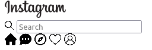

# Tarea

Para esta tarea vamos a recrear algunas de las estructuras más utilizadas dentro de la páginas webs, como son las cards y los navbar. Como guía y objetivo tendremos
las siguientes imágenes:

## Guia

Los pasos que debemos seguir para conseguir esta tarea, serán:

- Generar el HTML pertinente para cada ejemplo
- Tratar de replicar los ejemplos mostrados

Finalmente te invitamos a que una vez que lo hallas logrado, dejes volar tu creatividad y generes otros ejemplos por tu cuenta o trates de integrar los ejemplos antes mostrados.
